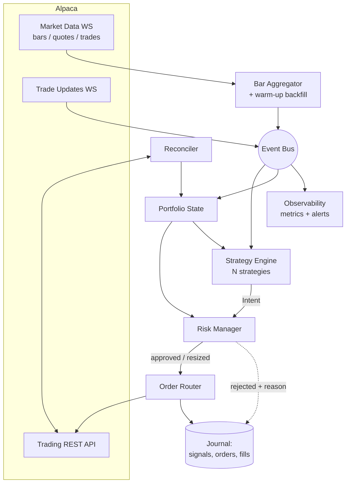

# Architecture

## 1. Shape of the system

The bot is a single-process, asyncio event loop. Market data arrives over
websockets, is aggregated into bars, and pushed onto an internal event bus.
Strategies subscribe to bar events and emit *intents*. Intents flow through the
risk manager to the order router, which talks to Alpaca. Fills arrive on a
separate websocket and update the portfolio.

## 2. Components

### 2.1 Config loader (`config.py`)
Loads YAML + environment, validates into typed dataclasses (or Pydantic models),
and fails fast on anything ambiguous. Refuses to start if `mode: live` is set
without the corresponding CLI flag and live-specific credentials.

### 2.2 Broker adapter (`broker/`)
A `Broker` protocol — `submit`, `cancel`, `cancel_all`, `get_positions`,
`get_orders`, `get_account`, `close_position`, `close_all` — with two
implementations:

- `AlpacaBroker` — wraps `alpaca-py`, handles retries, rate limiting, and error
  translation.
- `SimulatedBroker` — used by the backtester and by unit tests; models fills,
  slippage, and commissions.

Everything above this layer is broker-agnostic, which is what makes backtest and
live share one code path.

### 2.3 Market data (`data/`)
- **Historical client** for warm-up bars and backtests.
- **Live stream** wrapping `StockDataStream` / `CryptoDataStream`, with
  reconnect-with-backoff and a staleness watchdog.
- **Bar aggregator** builds higher timeframes (5m, 15m, 1h) from 1-minute bars
  so only one subscription is needed per symbol.
- **Gap detector** — if the expected bar for a symbol does not arrive within a
  grace window, the symbol is marked stale and strategies skip it rather than
  computing indicators on a hole.

### 2.4 Strategy engine (`strategies/`)
Owns the strategy registry and the per-bar evaluation loop. Strategies are pure
functions of `(bar window, portfolio snapshot, params) -> list[Intent]`. See
[strategy-framework.md](strategy-framework.md).

### 2.5 Risk manager (`risk/`)
The single mandatory gate before any order. Stateful — it tracks daily P&L,
day-trade count, per-symbol and gross exposure. Returns an `RiskDecision`:
`APPROVE`, `RESIZE(qty)`, or `REJECT(reason)`. See
[risk-management.md](risk-management.md).

### 2.6 Order router (`execution/`)
Translates intents into concrete Alpaca order requests, assigns
`client_order_id`, submits with retry, and tracks order lifecycle. Owns:

- idempotency (deterministic ids, dedupe on restart),
- order type selection (market vs marketable-limit, bracket construction),
- timeouts — a working order that has not filled within its budget is
  canceled and optionally re-priced,
- the cancel-all / flatten path used by the kill switch.

### 2.7 Portfolio (`portfolio/`)
Authoritative in-process view of positions, average cost, realized and
unrealized P&L, and open orders. Updated by the trade-updates stream and
corrected by the reconciler. Never trusted over the broker on conflict.

### 2.8 Reconciler
On startup and on a timer: fetch broker positions and open orders, diff against
local state, log every discrepancy at `ERROR`, and adopt broker state. A
discrepancy in position *quantity* is treated as an incident and can trip the
kill switch if `strict_reconciliation` is enabled.

### 2.9 Observability (`observability/`)
Structured JSON logs with a `correlation_id` threaded from bar → signal →
intent → order → fill; counters and gauges for orders, rejections, latency,
data staleness, and equity; alert dispatch on the events listed in
[operations.md](operations.md#4-alerting).

## 3. Concurrency model

One asyncio loop. Websocket handlers are async. Anything CPU-bound (indicator
computation over a large window, model inference) runs in a thread pool executor
so it cannot stall the heartbeat.

Two rules keep this safe:

1. **Portfolio and risk state are mutated only from the event loop thread.**
   Worker threads return values; they do not mutate shared state.
2. **Strategy evaluation is bounded.** A strategy exceeding its time budget is
   logged, its intents for that bar are discarded, and repeated offenses disable
   it for the session.

## 4. Event flow, in order

1. `BarEvent(symbol, timeframe, ohlcv, ts)` published after the aggregator seals
   a bar.
2. Strategy engine evaluates every strategy subscribed to that
   `(symbol, timeframe)`.
3. Each emitted `Intent` gets a correlation id derived from the triggering bar.
4. Risk manager evaluates intents **in deterministic order** (sorted by symbol)
   so that exposure caps consume budget predictably.
5. Order router submits approved intents; `OrderSubmitted` is journaled.
6. `TradeUpdate` events arrive asynchronously; portfolio applies them;
   `FillEvent` is published for strategies that care about their own fills.

## 5. State and persistence

| State | Home | Recovery |
|---|---|---|
| Positions, open orders | Alpaca (authoritative) | Fetched on startup |
| Bar history window | Memory | Re-backfilled from historical API on startup |
| Strategy internal state | Memory + optional snapshot file | Rebuilt by replaying the warm-up window |
| Journal (signals, decisions, orders, fills) | SQLite (v1), Postgres later | Append-only; never used to reconstruct positions |
| Day-trade counter, daily P&L | Derived from broker + journal | Recomputed at startup |

Strategy state must be **rebuildable from the bar window**. A strategy that
cannot be reconstructed by replaying its warm-up period is a design error,
because it cannot survive a restart.

## 6. Failure modes and responses

| Failure | Response |
|---|---|
| Market-data websocket disconnect | Reconnect with exponential backoff; mark symbols stale; suppress new entries while stale; alert after 30 s |
| Trade-updates websocket disconnect | Reconnect; on reconnect, immediately reconcile — fills may have been missed |
| REST 429 (rate limited) | Respect backoff, queue non-urgent calls; cancels and flattens jump the queue |
| Order rejected | Log with the broker reason; do not blind-retry; three rejections for one symbol disables that symbol for the session |
| Reconciliation mismatch | Adopt broker state, alert; trip kill switch if `strict_reconciliation` |
| Unhandled exception in strategy | Disable that strategy, keep the process alive, alert |
| Unhandled exception in engine core | Cancel all open orders, apply the configured shutdown policy, exit non-zero |

## 7. Why this shape

- **Single process** because one operator, one account, and modest data volume
  do not justify a message broker. The event bus is an in-process abstraction,
  so extracting it later is mechanical.
- **Protocol-based broker** because it is the only way to guarantee that what
  you backtested is what you run.
- **Risk as a separate gate** rather than inside strategies, so that adding a
  strategy cannot weaken the account-level limits.

See [adr/](adr/) for the decision records behind these.
